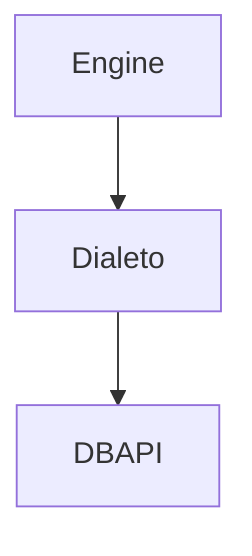

# SQLAlchemy

## Core
O core é o componente mais básico do SQLAlchemy (núcleo). Responsável por criar conexão com o banco de dados, fazer buscas e definir tipos.

### Engine
- **Connection**: Interface para se comunicar com o banco
- **Dialect**: Mecanismos específicos para cada banco de dados
- **Pool**: Deixa conexões em memória para ser mais fácil reutilizar

### SQL Expression Language
Construções em Python para representar SQL

### Schema/Types
Construções em python que representam tabelas, colunas e tipos de dados

### Engine
É uma fábrica de conexões com o banco de dados. O objetivo dela é que de forma dinâmica podemos nos comunicar com diferentes drivers de banco de dados usando dialetos específicos para cada banco de dados.

