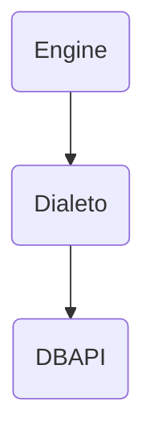
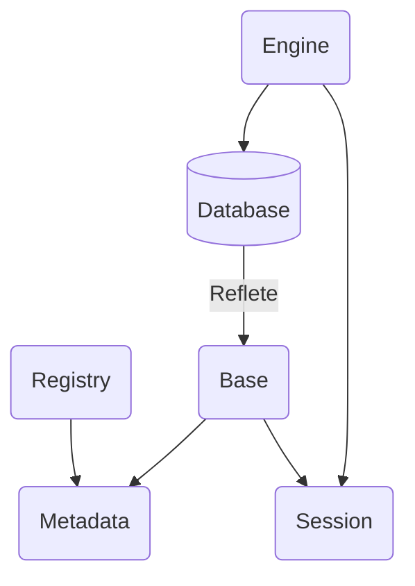

# SQLAlchemy

## Core

O core é o componente mais básico do SQLAlchemy (núcleo). Responsável por criar conexão com o banco de dados, fazer buscas e definir tipos.

1.Engine

- **Connection**: Interface para se comunicar com o banco
- **Dialect**: Mecanismos específicos para cada banco de dados
- **Pool**: Deixa conexões em memória para ser mais fácil reutilizar

2.SQL Expression Language

Construções em Python para representar SQL

3.Schema/Types

Construções em python que representam tabelas, colunas e tipos de dados

### Engine

É uma fábrica de conexões com o banco de dados. O objetivo dela é que de forma dinâmica podemos nos comunicar com diferentes drivers de banco de dados usando dialetos específicos para cada banco de dados.



Exemplo 01:

```python
from sqlalchemy import create_engine

# Factory
engine = create_engine('sqlite://') # em memória, para arquivos, usar equivalente a 'sqlite:///database.db'
```

### Dialetos

A `engine` fabrica uma conexão com a base de dados específica usando os dialetos. Dialetos são chamadas diretas para os drivers específicos para databases específicos.

Por exemplo, o SQLAlchemy suporta nativamente:

- SQLite
- PostgreSQL
- MySQL / MariaDB
- Oracle
- Microsoft SQL Server

Contando com diversas implementações via `plugins` como CockroachDB, Firebird, Amazon Redshift, ...

### Conexão

Com a engine conhecendo o dialeto especificado para conexão, ela pode iniciar a comunicação com o banco:

Exemplo 02:

```python
from sqlalchemy import create_engine

engine = create_engine('sqlite:///database.db', echo=True) # echo é para disparar logs no terminal

connection = engine.connect()
print(connection.connection.dbapi_connection)
# <sqlite3.Connection object at 0x747eb38e8f40>
connection.close()
```

### Pool

Uma instrução relativamente cara de `IO` é a criação da conexão com o banco de dados. Por esse motivo, o sqlalchemy armazena as conexões em um "reservatório" de conexões chamado `pool`

### Transação

Uma transação em um banco de dados é uma operação tratada como uma unidade de trabalho indivisível. **ACID** é uma sigla para as quatro principais características que definem uma transação:

- **Atomicidade**: cada instrução em uma transação (leitura, gravação, atualização ou exclusão de dados) é tratada como uma única unidade. Ou as instruções são todas executadas ou nenhuma é executada.
- **Consistência**: garante que a transação levará o banco de dados de um estado válido para outro estado válido, respeitando regras de negócio, restrições (_constraints_) e integridade dos dados.
- **Isolamento**: assegura que transações executadas simultaneamente não interfiram umas nas outras.
- **Durabilidade**: garante que, uma vez confirmada, a transação se torna permanente no sistema, mesmo em casos de falha de energia ou pane no servidor, os dados não são perdidos.

Exemplo 03:

```python
from sqlalchemy import create_engine, text

engine = create_engine('sqlite:///database.db', echo=True)
conn = engine.connect()

sql = text('select id, name, comment from comments')
result = conn.execute(sql)
conn.close()
```

Exemplo 04 (transação com gerenciador de contexto):

```python
from sqlalchemy import create_engine, text

engine = create_engine('sqlite:///database.db', echo=True)

with engine.connect() as conn:
    sql = text('select id, name, comment from comments')
    result = conn.execute(sql) 
```

Exemplo 05 (transação async):

```python
from sqlalchemy import text
from sqlalchemy.ext.asyncio import create_async_engine

engine = create_async_engine('URL')

async with engine.connect() as conn:
    sql = text('select id, name, comment from comments')
    result = await conn.execute(sql)
```

### Result

O resultado obtido no execute é um objeto especial chamado **Result**. Ele implementa diversos métodos, além de ser um iterável. Alguns métodos úteis:

- `.fetchone()`: pega o primeiro
- `.fetchmany(3)` ou `.partitions(3)`: pega alguns valores
- `.fetchall()` ou `.all()`: pega todos os valores
- `.first()`: pega 1, mas não dá erro se não conseguir

Exemplo 06:

```python
from sqlalchemy import create_engine, text

engine = create_engine(URL, echo=True)

with engine.connect() as conn:
    sql = text('select id, name, comment from comments')
    result = conn.execute(sql)
    print(result.first())
```

### Schemas e Types

Os metadados das tabelas podem ser descritos por Schemas (exemplo: nome das colunas) e seus determinados tipos

Exemplo 07:

```python
import sqlalchemy as sa

metadata = sa.MetaData()

t = sa.Table('comments', metadata,
    sa.Column('id', sa.Integer(), nullable=False),
    sa.Column('name', sa.String(), nullable=False),
    sa.Column('comment', sa.String(), nullable=False),
    sa.Column('live', sa.String(), nullable=False),
    sa.Column('created_at', sa.DateTime(), nullable=False),
    sa.PrimaryKeyConstraint('id')
)

engine = sa.create_engine('sqlite:///database.db')
metadata.create_all(engine)
```

### Reflection

As funções de inspeção são agregadas a construção de schemas, para evitar a criação dos metadados em um banco de já existe:

Exemplo 08:

```python
from sqlalchemy import create_engine, Table, MetaData

engine = create_engine('URL')
metadata = MetaData()

comments = Table('comments', metadata, autoload_with=engine)

print(comments.columns)
```

### SQL Expression Language

Até o momento, todas as operações foram feitas com text() e SQL bruto. O **Core** tem um grupo de funções e objetos que podem ajudar a montar SQL:

- **DQL**: Data Query Language
- **DML**: Data Manipulation Language

Usado em conjunto com os schemas.

#### DQL

Uma das partes mais importantes dentro dos bancos de dados é a busca pelos dados (chamado de Query). O SQLAlchemy tem um sistema completo e extenso sobre a criação de queries. Começando pelo básico, temos o **select()**:

```python
stmt = select(comments)
print(stmt)
# SELECT comments.id, comments.name, comments.comment, comments.live, comments.created_at FROM comments
```

##### CompoundSelect

O resultado do select é um builder, com ele podemos encadear comandos e fazer uma busca mais complexa:

```python
stmt = (
    select(comments.c.name, comments.c.comment) # .c é de coluna
    .where(comments.c.name == 'Lucas Borges')
    .limit(3)
    .offset(0)
    .order_by(comments.c.id)
)
```

#### DML

Quando precisamos manipular dados no SQL, usamos algumas das seguintes instruções:

- **delete**: remover registros
- **insert**: inserir registros
- **update**: atualizar registros

##### Insert

```python
stmt = insert(comments).values(
    name='lucas',
    comment='teste',
    live='youtube',
    created_at=datetime.now(),
)
```

##### Update

```python
stmt = (
    update(comments)
    .where(
        comments.c.name == 'lucas',
        comments.c.comment = 'teste',
        comments.c.live = 'youtube',
    )
    .values(comment='teste 2')
)
```

##### Delete

```python
stmt = delete(comments).where(
    comments.c.name == 'lucas',
    comments.c.live == 'youtube'
)
```

## ORM (Object-Relational Mapper)

- **Object**: um **objeto python**, como uma classe
- **Relational**: relacional é em relação aos bancos relacionais
- **Mapper**: quer dizer que é feito um **mapeamento entre os metadados** das tabelas em uma classe e cada row é relacionada a uma instância

Exemplo 09:

```python
from sqlalchemy import Column, DateTime, Integer, String, func
from sqlalchemy.orm import DeclarativeBase

class Base(DeclarativeBase):
    pass

class Comment(Base):
    __tablename__ = 'comments'

    id = Column(Integer, primary_key=True)
    name = Column(String, nullable=False)
    comment = Column(String, nullable=False)
    live = Column(String, nullable=False
    created_at = Column(DateTime, server_default=func.now())
```

Exemplo 10 (com typing):

```python
from datetime import datetime
from sqlalchemy import func
from sqlalchemy.orm import DeclarativeBase, Mapped, mapped_column

class Base(DeclarativeBase):
    pass

class Comment(Base):
    __tablename__ = 'comments'

    id: Mapped[int] = mapped_column(primary_key=True)
    name: Mapped[str]
    comment: Mapped[str]
    live: Mapped[str]
    created_at: Mapped[datetime] = mapped_column(server_default=func.now())
```

Exemplo 11 (com dataclasses):

```python
from datetime import datetime
from sqlalchemy import func
from sqlalchemy.orm import Mapped, mapped_column, registry

reg = registry()

@reg.mapped_as_dataclass
class Comment:
    __tablename__ = 'comments'

    id: Mapped[int] = mapped_column(init=False, primary_key=True)
    name: Mapped[str]
    comment: Mapped[str]
    live: Mapped[str]
    created_at: Mapped[datetime] = mapped_column(init=False, server_default=func.now())
```

### Session

A `session` faz o papel da "connection" do core, mas retorna objetos ORM na query.



Exemplo 12:

```python
from sqlalchemy.orm import Session

with Session(engine) as s:
    result = s.scalar(select(Comment).where(Comment.id == 1))
    s.delete(result)
    s.commit()
```

> Usar scalar() ou scalars() quando quisermos o objeto inteiro, se quisermos apenas algumas colunas, melhor usar fetch() e variações
